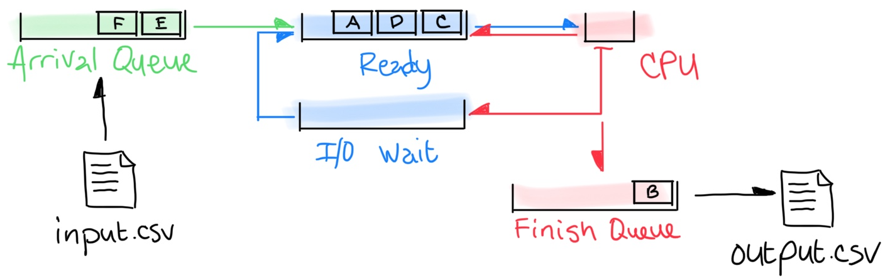

# A2: CPU Scheduler Simulator

You will write a program named `schsim` that simulates the CPU scheduler policies outlined in Chapter 9 of the _Operating Systems_ book. You will write this program in Zig.

## Input File Format

The input file will be a `.csv` containing a list of processes, at which CPU cycle they arrive, how many cycles they take to complete and an optional list of I/O times and how many cycles that I/O burst takes:

	"A", 0, 3
	"B", 2, 6
	, 3, 2
	"C", 4, 4
	"D", 6, 5
	"E", 8, 2

Each line in the file will either begin with a `"` character indicating it is a process or a `,` character indicating it is an I/O burst for the preceding process.

## Architecture

Here is the suggested architecture. When the **CPU** cycle clock is equal to the arrival time for a process in the **Arrival Queue**, it is moved from there into the **Ready Queue**. When a process is in any _blue_ queue, its time spent waiting increases. When a process is inside the **I/O Wait Queue**, its current I/O burst time decreases. When a process is in the **CPU**, its remaining time for service decreases (you need to remember the initial service time for output). When a process inside the **I/O Wait Queue** has its current I/O burst time reach zero, it is moved from there to the **Ready**. When a process in the **CPU** reaches zero remaining time for service, it is moved from there into the **Finish Queue**.

I will be looking for these major components in your program. They must be easily identifiable (objects or structs used). I will also be looking for a `select()` function that obtains a process from the **Ready Queue** according to the selected scheduler type and a `tick()` or `cycle()` function that advances the CPU (and related values, such as time spent waiting for other processes).

The program must implement all of the schedulers outlined in Chapter 9 of the **Operating Systems** book:

 - *FF: First-Come-First-Served*
 - *RR: Round Robin* (with settable quantum)
 - *SP: Shortest Process Next*
 - *SR: Shortest Remaining Time*
 - *HR: Highest Response Ratio Next*
 - *FB: Feedback* (with settable quantum)

The program will accept a switch `-s` which selects which scheduler to simulate, an optional time quantum `-q` and an input and output filename:

	./schsim -s FF -q 2 input.csv output.csv

If the optional time quantum is provided for a selected scheduler that doesn't require it, the program ignores that switch and runs normally. For the feedback scheduling policy, the quantum is only allowed to be 1 or 2 meaning *q = 1* and *q = 2* quantum values from the book, respectively.

## Output File Format

The output file will look similar to the input file, but will have added the process start time, finish time, turnaround time, normalized turnaround time (as a float with 2 decimal points) and time spent in wait for each of the processes. Finally it will list the mean turnaround time and the mean normalized turnaround time.

	"A", 0, 3, 0, 3, 3, 1.00
	"C", 4, 4, 6, 10, 6, 1.50
	"B", 2, 6, 3, 13, 11, 1.83
	"D", 6, 5, 13, 18, 12, 2.40
	"E", 8, 2, 18, 20, 12, 6.00
	8.80, 2.55

## Verbose Mode

It would be ideal for a verbose mode to be implemented that showed where each process was for each step in the simulation. The verbose output of the reference program is given below:

    $ ./schsim -v -s FF ../examples/input1/in.csv FF.csv
        | A | B | C | D | E |
      0:  #                 | arrival = {B, C, D, E}
      1:  #                 | arrival = {B, C, D, E}
      2:  #                 | arrival = {C, D, E} ready = {B}
      3:      #             | arrival = {C, D, E}
      4:      #             | arrival = {D, E} ready = {C}
      5:      #             | arrival = {D, E} ready = {C}
      6:          #         | arrival = {E} ready = {D} io = {B}
      7:          #         | arrival = {E} ready = {D} io = {B}
      8:          #         | ready = {D, E, B}
      9:          #         | ready = {D, E, B}
     10:      #             | ready = {D, E}
     11:      #             | ready = {D, E}
     12:      #             | ready = {D, E}
     13:              #     | ready = {E}
     14:              #     | ready = {E}
     15:              #     | ready = {E}
     16:              #     | ready = {E}
     17:              #     | ready = {E}
     18:                  # |
     19:                  # |
     20:                    |

